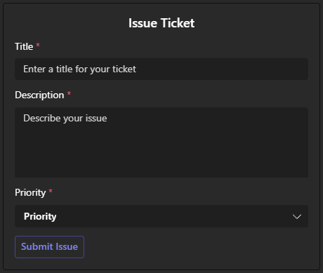
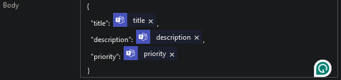
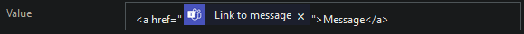
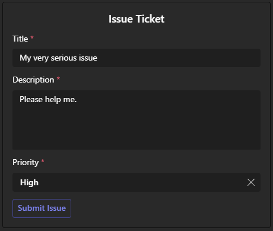
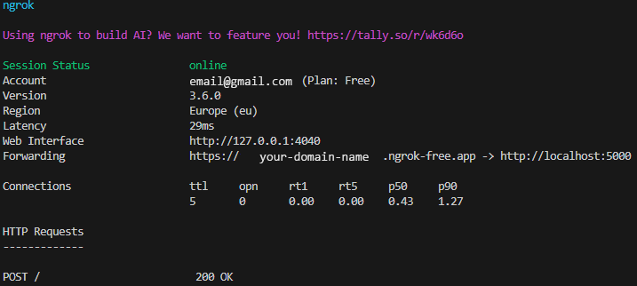
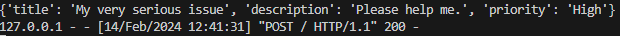
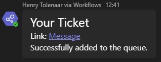
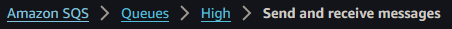
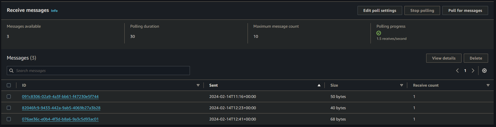
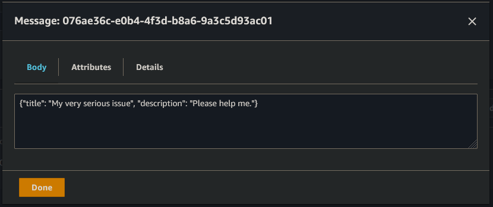

# ITSM/Ticketing System Integration with AWS

This document will cover the setup, deployment, and configuration of the ticketing system.

## Setup

### Prerequisites

Python `pip` install the following libraries:

- `Flask`
- `boto3`

### Step 1. Create a new MS Teams Team for the ticketing system.

1.  Click the `+` button on the Teams tab of MS Teams and select `Create team`.
2.  Select `From scratch` > `Public`, then give your new team a name and description, and click `Create`.
3.  Create a new channel in the team by clicking the ellipsis button, then `Add channel`.
4.  Give the channel a name and select `Standard` access.

### Step 2. Add required Apps to MS Teams.

Click the ellipsis button on the left bar and search for `Developer Portal` and add this to teams (right-click to pin the app to the left bar).

### Step 3. Build your ticket as an adaptive card.

1.  Open the `Developer Portal` app and select `Design and build Adaptive Cards`.
2.  Click `+ New card` at the top of the page.
3.  Drag and drop elements from the left menu to create your ticket as a card. 1. The ticket should a title, description, and priority level, and an `ActionSet` `Action.Submit` action. 2. Copy the json in the bottom panel and keep it somewhere you can later access. 3. Save the card.
    Example Card:
    

### Step 4. Go to [https://ngrok.com/](https://ngrok.com/) and create an account.

1.  Follow the installation steps.
2.  In the `Deploy your app online` section, select the second tab `Static Domain`.
3.  Click the link to claim your free static domain, and save the command presented, it should look like this: `ngrok http --domain=your-domain-name.ngrok-free.app 80`

### Step 5. Build a Power Automate Solution.

1.  Navigate to [Power Automate Solutions](https://make.powerautomate.com).
2.  Click `+ New solution` at the top left of the screen, fill in the fields and click `Create`.
3.  Create the first workflow.
    1. In the solution click `+ New` > `Automation` > `Cloud flow` > `Instant`.
    2. Search for and select `Manually trigger a flow` as your trigger from Power Automate.
       1. Leave the inputs blank.
    3. Click the `+` button, search for and add `Post card in a chat or channel`.
       1. Select the `Post As` field to be `Flow bot`.
       2. Select the `Post In` field to be `Channel`.
       3. Select the `Team` field to be the team you set up in step 1.
       4. Select the `Channel` field to be the channel you set up in step 1.
       5. Paste your adaptive card in the `Adaptive Card` field.
       6. Click `Show all` advanced parameters.
       7. Give an ID to your card and put in into the `Card Type ID` field.
    4. Save this workflow.
4.  Create the second workflow.
    1. In the solution click `+ New` > `Automation` > `Cloud flow` > `Automated`.
    2. Search for and select `When someone responds to an adaptive card` as your trigger from MS Teams.
       1. Paste your adaptive card json into the `Inputs Adaptive Card` field.
       2. Use the same ID used in the first workflow in the `Card Type Id` field.
    3. Click `+ New step` and search for, then select `HTTP`.
       1. Select the `Method` field to be `POST`.
       2. Paste your free static domain name from ngrok with an `https://` in front in the `URL` field.
          1. The whole URL should look like this: `https://your-domain-name.ngrok-free.app/`
       3. Click the `Switch Headers to text mode` button on the right of the `Headers` section and paste in the following headers:
          ```json
          {
            "Accept": "*/*",
            "Content-Type": "application/json",
            "Host": "your-domain-name.ngrok-free.app",
            "User-Agent": "PowerAutomateWorkflow",
            "Accept-Encoding": "gzip, deflate, br",
            "Connection": "keep-alive"
          }
          ```
       4. Make sure to replace `your-domain-name` with your actual domain name.
       5. Paste the following into the `Body` field:
          ```json
          {
              "title": <dynamic-data>,
              "description": <dynamic-data>,
              "priority": <dynamic-data>
          }
          ```
       6. Replace `<dynamic-data>` with dynamic data from `When someone responds to an adaptive card` called `title`, `description`, and `priority`.
          
    4. Click `+ New step` and search for, then select `Initialize variable`.
       1. Enter a name in the `Name` field.
       2. Use `String` in the `Type` field.
       3. Put an HTML link tag with the dynamic data for the link the the message in the `Value` field.
          
    5. Click `+ New step` and search for, then select `Reply with a message in a channel`.
       1. Leave `Post as` field to be `Flow bot`.
       2. Select the `Post in` field to be `Chat with Flow bot`.
       3. Select the `Recipient` field to be dynamic data of `Responder User ID` from `When someone responds to an adaptive card`.
       4. Write a message in the `Message` field using the link variable to link to the message and the body dynamic data to get the response body.
    6. Save this workflow.

---

## AWS Configurations

### IAM User

1. Open the AWS Management Console and navigate to `IAM`.
2. Select `Users` on the left panel then click `Create user`.
3. Enter a name like `Ticket queuer` and click `Next`.
4. Under permissions keep the `Add user to group` option selected.
5. Under `User groups` create a new user group.
   1. Add a name for the user group like `TicketQueuer`.
   2. Search and select the permission policy called `AmazonSQSFullAccess`.
   3. Select `Create user group` to create the group.
6. Select your newly created user group and click `Next`.
7. Click `Create user` to create the IAM user.
8. Under the `Security credentials` tab and `Access keys` section, click `Create access key`.
   1. Select `Local code`, tick the confirmation box and click `Next`.
   2. Click `Create access key`.
   3. Save both the public and private access keys somewhere safe, not in plain text.

### `aws configure`

1. Download AWS CLI from [https://aws.amazon.com/cli/](https://aws.amazon.com/cli/).
2. Run the command `aws configure` in a terminal and complete the steps (choose a region that is close to you for minimum latency).

### boto3

Use boto3 to create 3 queues: `Low`, `Medium`, and `High` (the names should be identical to the priority options on your adaptive card) by using the following code.

```Python
import boto3

sqs = boto3.resource('sqs')

sqs.create_queue(QueueName='Low', Attributes={'DelaySeconds': '5'})
sqs.create_queue(QueueName='Medium', Attributes={'DelaySeconds': '5'})
sqs.create_queue(QueueName='High', Attributes={'DelaySeconds': '5'})
```

---

## Deployment

- Run the ngrok domain using the command `ngrok http --domain=your-domain-name.ngrok-free.app 5000` (make sure it is running on port **5000**) in a terminal.
- In a separate terminal, run the Python flask app using the command `flask run` in the **same folder** that your flask app is located.

#### Usage

Fill out the adaptive card you created in step 3 of the setup and press the `Submit` button.



Check both terminals to see if the request was successful.




Check your direct chats to see if a confirmation message was sent.



Check the SQS queues in the AWS Management Console by polling them and confirming the message is in the correct queue.






