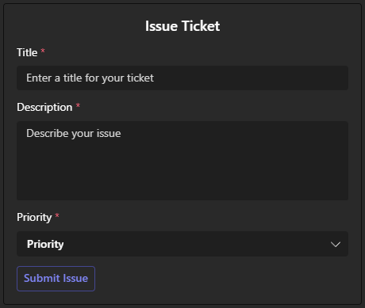
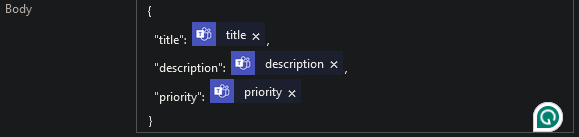
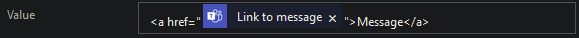
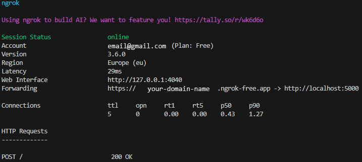
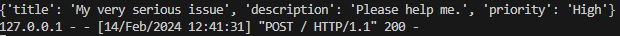
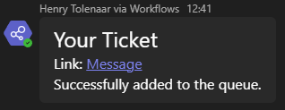
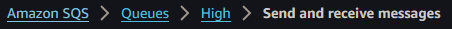
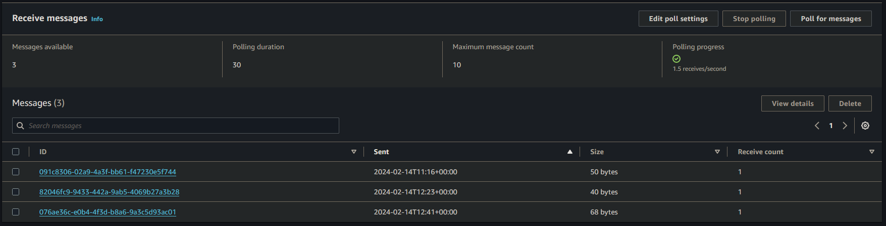
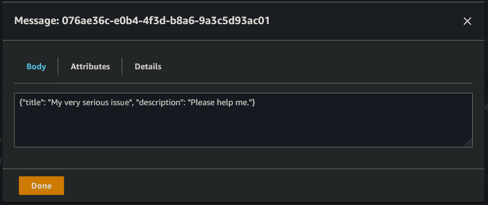

<a name="readme-top"></a>

[![Contributors][contributors-shield]][contributors-url]
[![Forks][forks-shield]][forks-url]
[![Stargazers][stars-shield]][stars-url]
[![Issues][issues-shield]][issues-url]
[![MIT License][license-shield]][license-url]
[![LinkedIn][linkedin-shield]][linkedin-url]

<br />
<div align="center">
  <a href="https://github.com/FZenji/TSI-Training/tree/master/AWS/Ticketing-System">
    
  </a>
    <h3 align="center">AWS Ticket Service</h3>

<p align="center">
     A component of an IT Service Ticketing system that automates the classification and routing of support tickets. This system leverages AWS services to manage ticket queues, improving the efficiency and responsiveness of IT support services. 
    <br />
    <a href="https://github.com/FZenji/TSI-Training/tree/master/AWS/Ticketing-System"><strong>Explore the docs »</strong></a>
    <br />
    <br />
    <a href="https://github.com/FZenji/TSI-Training/tree/master/AWS/Ticketing-System/issues">Report Bug</a>
    ·
    <a href="https://github.com/FZenji/TSI-Training/tree/master/AWS/Ticketing-System/issues">Request Feature</a>
</p>

</div>

<!-- TABLE OF CONTENTS -->
<details>
  <summary>Table of Contents</summary>
  <ol>
    <li>
      <a href="#about-the-project">About The Project</a>
      <ul>
        <li><a href="#features">Features</a></li>
        <li><a href="#tools-used">Tools Used</a></li>
      </ul>
    </li>
    <li>
      <a href="#setup">Setup</a>
      <ul>
        <li><a href="#prerequisites">Prerequisites</a></li>
      </ul>
      <ol>
        <li><a href="#step1">Step 1. Create a new MS Teams Team for the ticketing system.</a></li>
        <li><a href="#step2">Step 2. Add required Apps to MS Teams.</a></li>
        <li><a href="#step3">Step 3. Build your ticket as an adaptive card.</a></li>
        <li><a href="#step4">Step 4. Go to https://ngrok.com/ and create an account.</a></li>
        <li><a href="#step5">Step 5. Build a Power Automate Solution.</a></li>
      </ol>
    </li>
    <li>
      <a href="#AWS-configurations">AWS Configurations</a>
      <ul>
        <li><a href="#IAM-User">IAM User</a></li>
        <li><a href="#awsConfig">aws configure</a></li>
        <li><a href="#boto3">boto3</a></li>
      </ul>
    </li>
    <li><a href="#deployment">Deployment</a></li>
      <ul>
        <li><a href="#prerequisites">Usage</a></li>
      </ul>
    <li><a href="#License">License</a></li>
    <li><a href="#Acknowledgments">Acknowledgments</a></li>
  </ol>
</details>

# ITSM/Ticketing System Integration with AWS

This document will outline the features, tools used, setup, configuration, and deployment of the ticketing system.

<!-- ABOUT THE PROJECT -->

## About The Project

The AWS Ticket Service enables issue ticketing from straight within Microsoft Teams. The user is presented with a configurable issue report ticket that offloads the inputted user data into a Power Automate Solution workflow that makes a POST request to a custom Python Flask backend API. The data is subsequently passed into scalable, priority based AWS SQS queues for further serverless processing via AWS Lambda or any other means.

### Features

- Customer Service: The customer is always the number one priority and this system allows them to send their problems directly to the relevant place in order to get them resolved as soon as possible.
- Microsoft Teams: Fully integrated into Teams, allowing updates to tickets to be send directly to the customer keeping them informed and happy.
- Power Automate Solutions: Automates the ticketing process, with in-built error handling, data validation and sanitisation.
- AWS Cloud: Tickets are kept in AWS SQS queues, offering high availability, scalability, reliability, and performance.

### Tools Used

[![Python][python.org]][Flask-url]<br />
[![Flask][Flask.com]][Flask-url]<br />
[![Power Automate][PowerAutomate.com]][power-automate-url]<br />
[![Amazon SQS][aws-sqs.com]][aws-sqs-url]<br />
[![Microsoft Teams][teams.com]][teams-url]<br />

<!-- SETUP -->

## Setup

### Prerequisites

Python `pip` install the following libraries:

- `Flask`
- `boto3`

<a name="step1"></a>

### Step 1 Create a new MS Teams Team for the ticketing system.

1.  Click the `+` button on the Teams tab of MS Teams and select `Create team`.
2.  Select `From scratch` > `Public`, then give your new team a name and description, and click `Create`.
3.  Create a new channel in the team by clicking the ellipsis button, then `Add channel`.
4.  Give the channel a name and select `Standard` access.

<a name="step2"></a>

### Step 2. Add required Apps to MS Teams.

Click the ellipsis button on the left bar and search for `Developer Portal` and add this to teams (right-click to pin the app to the left bar).

<a name="step3"></a>

### Step 3. Build your ticket as an adaptive card.

1.  Open the `Developer Portal` app and select `Design and build Adaptive Cards`.
2.  Click `+ New card` at the top of the page.
3.  Drag and drop elements from the left menu to create your ticket as a card. 1. The ticket should a title, description, and priority level, and an `ActionSet` `Action.Submit` action. 2. Copy the json in the bottom panel and keep it somewhere you can later access. 3. Save the card.
Example Card:
<p align="center">
  
  <!--  -->
</p>
<a name="step4"></a>

### Step 4. Go to [https://ngrok.com/](https://ngrok.com/) and create an account.

1.  Follow the installation steps.
2.  In the `Deploy your app online` section, select the second tab `Static Domain`.
3.  Click the link to claim your free static domain, and save the command presented, it should look like this: `ngrok http --domain=your-domain-name.ngrok-free.app 80`

<a name="step5"></a>

### Step 5. Build a Power Automate Solution.

1.  Navigate to [Power Automate Solutions](https://make.powerautomate.com).
2.  Click `+ New solution` at the top left of the screen, fill in the fields and click `Create`.
3.  Create the first workflow.
    1. In the solution click `+ New` > `Automation` > `Cloud flow` > `Instant`.
    2. Search for and select `Manually trigger a flow` as your trigger from Power Automate.
       1. Leave the inputs blank.
    3. Click the `+` button, search for and add `Post card in a chat or channel`.
       1. Select the `Post As` field to be `Flow bot`.
       2. Select the `Post In` field to be `Channel`.
       3. Select the `Team` field to be the team you set up in step 1.
       4. Select the `Channel` field to be the channel you set up in step 1.
       5. Paste your adaptive card json in the `Adaptive Card` field.
       6. Click `Show all` advanced parameters.
       7. Give an ID to your card and put in into the `Card Type ID` field.
    4. Save this workflow.
4.  Create the second workflow.
    1. In the solution click `+ New` > `Automation` > `Cloud flow` > `Automated`.
    2. Search for and select `When someone responds to an adaptive card` as your trigger from MS Teams.
       1. Paste your adaptive card json into the `Inputs Adaptive Card` field.
       2. Use the same ID used in the first workflow in the `Card Type Id` field.
    3. Click `+ New step` and search for, then select `HTTP`.
       1. Select the `Method` field to be `POST`.
       2. Paste your free static domain name from ngrok with an `https://` in front in the `URL` field.
          1. The whole URL should look like this: `https://your-domain-name.ngrok-free.app/`
       3. Click the `Switch Headers to text mode` button on the right of the `Headers` section and paste in the following headers:
          ```json
          {
            "Accept": "*/*",
            "Content-Type": "application/json",
            "Host": "your-domain-name.ngrok-free.app",
            "User-Agent": "PowerAutomateWorkflow",
            "Accept-Encoding": "gzip, deflate, br",
            "Connection": "keep-alive"
          }
          ```
       4. Make sure to replace `your-domain-name` with your actual domain name.
       5. Paste the following into the `Body` field:
          ```json
          {
              "title": <dynamic-data>,
              "description": <dynamic-data>,
              "priority": <dynamic-data>
          }
          ```
       6. Replace `<dynamic-data>` with dynamic data from `When someone responds to an adaptive card` called `title`, `description`, and `priority`. <br>
          
    4. Click `+ New step` and search for, then select `Initialize variable`.
       1. Enter a name in the `Name` field.
       2. Use `String` in the `Type` field.
       3. Put an HTML link tag with the dynamic data for the link the the message in the `Value` field.
          
    5. Click `+ New step` and search for, then select `Reply with a message in a channel`.
       1. Leave `Post as` field to be `Flow bot`.
       2. Select the `Post in` field to be `Chat with Flow bot`.
       3. Select the `Recipient` field to be dynamic data of `Responder User ID` from `When someone responds to an adaptive card`.
       4. Write a message in the `Message` field using the link variable to link to the message and the body dynamic data to get the response body.
    6. Save this workflow.

<p align="right"><a href="#readme-top">Back to top &#8593;</a></p>

<!-- CONFIGURATION -->

## AWS Configurations

### IAM User

1. Open the AWS Management Console and navigate to `IAM`.
2. Select `Users` on the left panel then click `Create user`.
3. Enter a name like `Ticket queuer` and click `Next`.
4. Under permissions keep the `Add user to group` option selected.
5. Under `User groups` create a new user group.
   1. Add a name for the user group like `TicketQueuer`.
   2. Search and select the permission policy called `AmazonSQSFullAccess`.
   3. Select `Create user group` to create the group.
6. Select your newly created user group and click `Next`.
7. Click `Create user` to create the IAM user.
8. Under the `Security credentials` tab and `Access keys` section, click `Create access key`.
   1. Select `Local code`, tick the confirmation box and click `Next`.
   2. Click `Create access key`.
   3. Save both the public and private access keys somewhere safe, not in plain text.

<a name="awsConfig"></a>

### `aws configure`

1. Download AWS CLI from [https://aws.amazon.com/cli/](https://aws.amazon.com/cli/).
2. Run the command `aws configure` in a terminal and complete the steps (choose a region that is close to you for minimum latency).

### boto3

Use boto3 to create 3 queues: `Low`, `Medium`, and `High` (the names should be identical to the priority options on your adaptive card) by using the following code.

```Python
import boto3

sqs = boto3.resource('sqs')

sqs.create_queue(QueueName='Low', Attributes={'DelaySeconds': '5'})
sqs.create_queue(QueueName='Medium', Attributes={'DelaySeconds': '5'})
sqs.create_queue(QueueName='High', Attributes={'DelaySeconds': '5'})
```

<p align="right"><a href="#readme-top">Back to top &#8593;</a></p>

<!-- DEPLOYMENT -->

## Deployment

- Run the first workflow in the Power Automate solution from step 5 so that your adaptive card is sent to the channel and ready to be filled in.
- Run the ngrok domain using the command `ngrok http --domain=your-domain-name.ngrok-free.app 5000` (make sure it is running on port **5000**) in a terminal.
- In a separate terminal, run the Python flask app using the command `flask run` in the **same folder** that your flask app is located.

### Usage

Fill out the adaptive card you created in step 3 of the setup and press the `Submit` button.

<p align="center">
  
</p>

Check both terminals to see if the request was successful.

<p align="center">
  
  
</p>

Check your direct chats to see if a confirmation message was sent.

<p align="center">
  
</p>

Check the SQS queues in the AWS Management Console by polling them and confirming the message is in the correct queue.

<p align="center">
  
  
  
</p>

<p align="right"><a href="#readme-top">Back to top &#8593;</a></p>

<!-- LICENSE -->

## License

Distributed under the MIT License. See `LICENSE.md` for more information.

<!-- ACKNOWLEDGMENTS -->

## Acknowledgments

- [othneildrew README template](https://github.com/othneildrew/Best-README-Template/tree/master)

<!-- MARKDOWN LINKS & IMAGES -->

[contributors-shield]: https://img.shields.io/github/contributors/FZenji/TSI-Training.svg?style=for-the-badge
[contributors-url]: https://github.com/FZenji/TSI-Training/tree/master/AWS/Ticketing-System/graphs/contributors
[forks-shield]: https://img.shields.io/github/forks/FZenji/TSI-Training.svg?style=for-the-badge
[forks-url]: https://github.com/FZenji/TSI-Training/tree/master/AWS/Ticketing-System/network/members
[stars-shield]: https://img.shields.io/github/stars/FZenji/TSI-Training.svg?style=for-the-badge
[stars-url]: https://github.com/FZenji/TSI-Training/tree/master/AWS/Ticketing-System/stargazers
[issues-shield]: https://img.shields.io/github/issues/FZenji/TSI-Training.svg?style=for-the-badge
[issues-url]: https://github.com/FZenji/TSI-Training/tree/master/AWS/Ticketing-System/issues
[license-shield]: https://img.shields.io/github/license/FZenji/TSI-Training.svg?style=for-the-badge
[license-url]: https://github.com/FZenji/TSI-Training/tree/master/AWS/Ticketing-System/LICENSE.md
[linkedin-shield]: https://img.shields.io/badge/-LinkedIn-black.svg?style=for-the-badge&logo=linkedin&colorB=555
[linkedin-url]: https://www.linkedin.com/in/henry-tolenaar/
[Python.org]: https://img.shields.io/badge/python-3670A0?style=for-the-badge&logo=python&logoColor=ffdd54
[Python-url]: https://www.python.org/
[Flask.com]: https://img.shields.io/badge/flask-%23000.svg?style=for-the-badge&logo=flask&logoColor=white
[Flask-url]: https://flask.palletsprojects.com/en/3.0.x/
[PowerAutomate.com]: https://img.shields.io/badge/power%20automate-0060aa?style=for-the-badge&logo=powerautomate
[power-automate-url]: https://www.microsoft.com/en-gb/power-platform/products/power-automate
[aws-sqs.com]: https://img.shields.io/badge/Amazon%20SQS-FF4F8F?logoColor=FFFFFF&style=for-the-badge&logo=amazonsqs
[aws-sqs-url]: https://aws.amazon.com/sqs/
[teams.com]: https://img.shields.io/badge/Microsoft%20Teams-6264A7?logoColor=FFFFFF&style=for-the-badge&logo=microsoftteams
[teams-url]: https://www.microsoft.com/en-gb/microsoft-teams/group-chat-software
